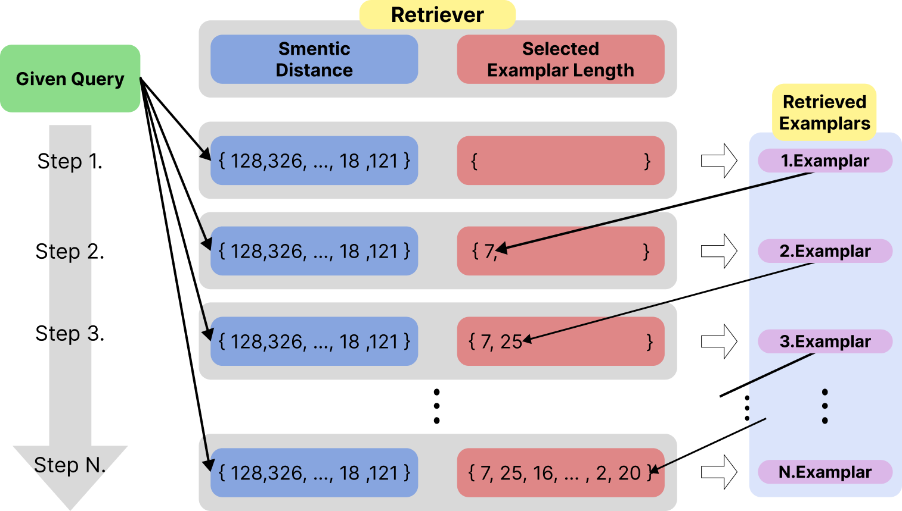

# Considering Length Diversity in Retrieval-Augmented Summarization

[](#) [](DL-MMR)

**Accepted to NAACL Findings**  
**Authors:** Juseon-Do, Jaesung Hwang, Jingun Kwon, Hidetaka Kamigaito, Manabu Okumura
[**Read the Paper**]()



## 📚 Overview
This paper introduces a **Diverse Length-aware MMR algorithm** that improves retrieval-augmented summarization by incorporating exemplar length diversity, yielding more appropriate and informative summaries with drastically reduced computational cost even on the datasets such as BNC and Broadcast that have diverse length distributions.


## 🚀 Getting Started
### 1. Clone the Repository
```
$ git clone https://github.com/JuseonDo/DL-MMR.git
```

### 2. Run
```
$ cd DL-MMR
$ bash scripts/save_metadata.sh
$ bash scripts/calcuate_distance.sh
$ bash scripts/retrieve.sh
$ bash scripts/inference.sh
```


## 📂 DL-MMR Dataset Structure
```
DL-MMR
|
├── dataset
│   ├── Google
│   ├── Broadcast
│   └── BNC
|   
├── scripts
|
└── src
    └── faiss_utils
    └── inference_utils
    └── rag_utils
```


# 🔍 Evaluation
The metrics used in this work are in [evaluation_metrics](https://github.com/JuseonDo/InstructCMP/evaluation).

```python
post_processed_outputs = generated_output_post_processing(generated_text)
result = evaluate(targets, sources, post_processed_outputs)
```

# Contact
If you have any questions about this work, please contact **Juseon-Do** using the following email addresses: **dojuseon@gmail.com** or **doju00@naver.com**. 

